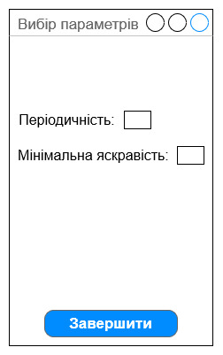
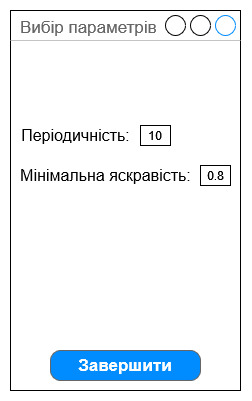
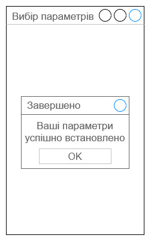

| NFR iD | TC id | Опис кроків тестового сценарію | Опис очікуваних результатів |
| ----- | ----- | ------------------------------ | --------------------------- |
| NFR1.1 | TC1.4 |  Початкові умови: відсутні.   Кроки сценарію: відсутні. | Екрана форма:    |
| NFR1.1 | TC1.5 |  Початкові умови: успішно пройдено TC1.4.   Кроки сценарію:   1) В поле «Періодичність» внесено значення 10   2) В поле «Мінімальна яскравість» внесено значення 0.8 | Екрана форма:    |
| NFR1.1 | TC1.6 | Початкові умови: успішно пройдено TC1.5.   Кроки сценарію:   1) Натиснуто кнопку «Завершити» | Екрана форма:    |
